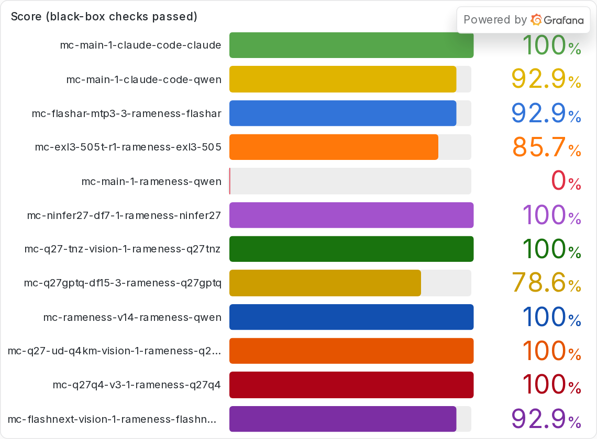
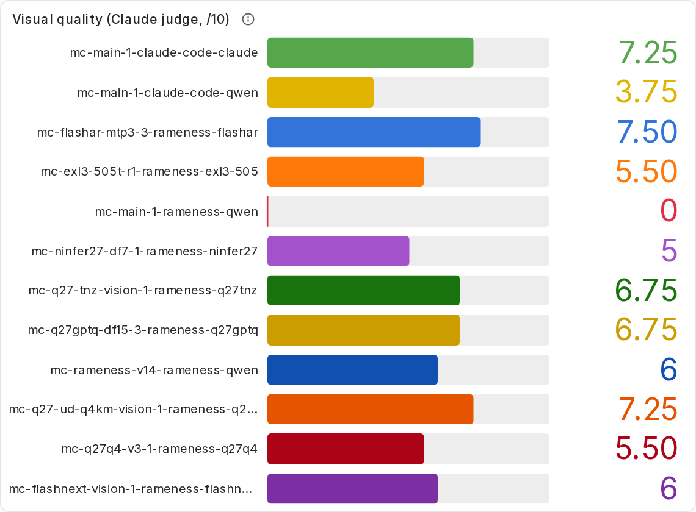
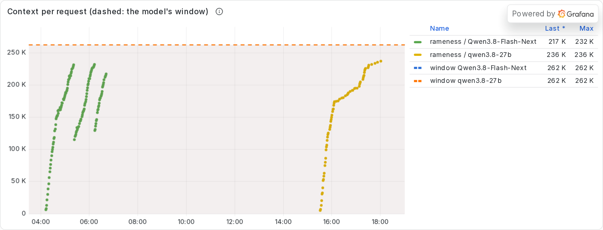
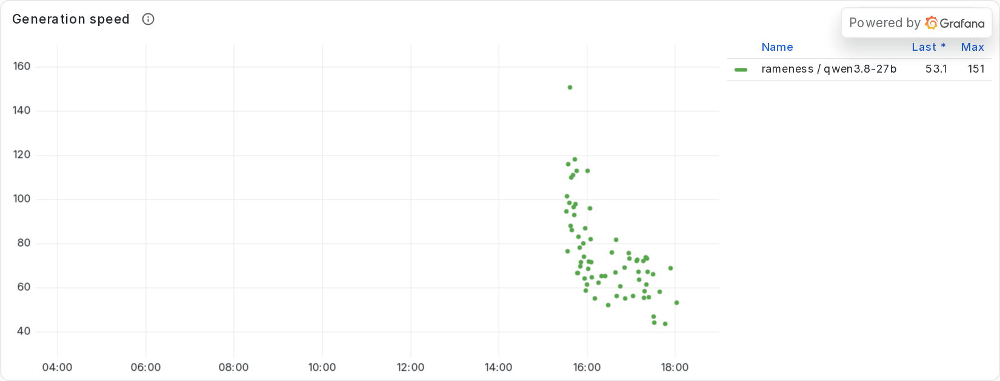

<div align="center"></div>
<div align="center"></div>


**One of the first working Jev-based agent manager harnesses, and one that improves itself**
(other Jev-driven harnesses so far exist mainly as papers and guides). A typed decision model
(Kev or Laya running locally, or TypeSafe AI's hosted Jev), never an LLM, makes the
multiple-choice and multi-probability calls that other harnesses (claude-code, codex, pi)
hard-code: whether a task needs reasoning, which procedures apply, which model, agent runtime
and machine should do the work, when to fork, what to do when something fails. Before any
decision takes effect, JEV asks itself whether it is routine enough to make alone, or
significant enough for you. Everything it decides is visible in a live **shadow** view.

It improves with use, without retraining the model that does the work:

* **It learns procedures.** Steps that recur across runs become tested SOPs (scripts, composites
  or skills), which later tasks run directly instead of re-deriving them.
* **Its decisions get better.** Every decision is logged with its outcome; the outcomes calibrate
  JEV's options, and the log is a training set for fine-tuning the decision model itself.
* **It refines its own work.** Refine and test cycles let JEV pick the next improvement and decide
  when the work has converged.

```
                         you (director)
                               │  UI · CLI
                        ┌──────▼──────┐     JEV: intake · role · fork · slot · environment ·
                        │   manager   │          failure · stall · questions · fork winner
                        └──┬───────┬──┘     comfort gate → "Needs you" when significant/uncertain
                  ┌────────▼┐     ┌▼────────┐
                  │  lead   │     │associate│  each agent = runtime × model slot × environment
                  └┬───────┬┘     └─────────┘  in its own git worktree and session
            ┌──────▼┐ ┌────▼──┐                (herdr tab · tmux window · screen · headless)
            │assoc. │ │assoc. │
            └───────┘ └───────┘
```

## Install

```bash
curl -fsSL https://raw.githubusercontent.com/Prog-Ramen/Rameness/main/install.sh | bash
# or from a checkout:  ./install.sh [--with-kev] [--no-laya] [--with-herdr] [--prefix DIR] [--dev]
```

One self-contained environment (`~/.rameness/env`) with the harness, the fleet manager, the UI,
the builtin SOPs, both model SDKs and [Laya](https://github.com/NandhaKishorM/laya) (pulls PyTorch).
The `rameness` launcher goes in `~/.local/bin`.

## Decision model setup

JEV's decisions come from a typed decision model, not an LLM. Pick one:

| | Laya (installed by default) | Kev (`--with-kev`) | TypeSafe Jev (subscription) |
|---|---|---|---|
| What | open-source, 421M params | open-source, Qwen3.5-4B based | hosted by TypeSafe AI |
| Accuracy (`rameness jev bench`) | 0.73 | 0.93 | not measured here |
| Speed | ~0.13 s CPU | ~0.9 s CPU (bf16), ~20 ms GPU | network round trip |
| Memory | ~1.7 GB | ~9 GB GPU, ~8-12 GB CPU (bf16 where the CPU supports it) | none locally |
| Cost | free | free | per call |

Which to pick: Laya is light enough for any machine but less accurate; Kev is the better decision-maker
but needs a GPU with ~10 GB free, or 8-12 GB of RAM and ~0.9 s per decision on CPU (a run makes one or two
decisions per turn, so on CPU it adds roughly a second to each turn). Use Kev when you have the memory.

**Laya** is installed with rameness. Start its server once per machine:

```bash
rameness jev up                    # starts the configured server (jev.serve, default laya) on 127.0.0.1:8000
rameness jev status                # what's installed, what's answering, which one decisions use
```

`rameness up` starts it for you. Without a server, a single `rameness run` still uses Laya
in-process (`laya-local`); the server is what lets the manager and every fleet worker share one copy.

**Kev** is more accurate and wants a GPU. It gets its own environment (Python 3.13 and a pinned
PyTorch) under `~/.rameness/jev/kev`, so its dependencies never touch rameness's:

```bash
rameness jev setup kev             # or install.sh --with-kev; weights (~9 GB) download on first start
rameness jev up kev                # 127.0.0.1:8008; uses the GPU if it has ~10 GB free
```

To make `rameness up` start Kev instead of Laya, and to run it on CPU when the GPU is busy
(for example with your own llama-server), set in `~/.rameness/config.json`:

```json
{"jev": {"serve": "kev", "serve_device": "cpu"}}
```

**TypeSafe's hosted Jev** needs an API key from TypeSafe AI. Keep it in the environment, not in
a config file, e.g. in `~/.bashrc`:

```bash
export TYPESAFE_API_KEY=ts_...
```

With a key set, TypeSafe is used when no local model is running, and covers a local server
outage. To use it for every decision, set `{"jev": {"backend": "typesafe"}}`.

`auto` (the default) picks, in order: a running Kev server, a running Laya server, Laya
in-process, TypeSafe if a key is set. With none of them, rameness warns and falls back to an
offline keyword scorer. `rameness jev bench` measures whatever is active.

## Safety

* Tools run **without a sandbox** by default: `bash` and the file tools act on your machine as your user.
  Permission modes: `ask` (default: you approve each action), `auto` (`-y`, approve everything), `readonly`.
  Use `-y` only in a disposable environment (a container, a VM, a throwaway checkout), or run agents in a
  `container` environment (see the fleet section).
* The manager UI and API bind to 127.0.0.1 and have **no authentication**. Don't expose the port.
* Validated, shareable SOPs are automatically proposed as public PRs after successful tasks, with the secret and
  privacy checks described below. Set `registry.auto_propose: false` to keep proposals manual.

## Quick start

```bash
rameness jev up                    # JEV's local decision model (see "Decision model setup")
cd your-project && rameness init
rameness fleet slots               # models: API keys, llama-server/ollama/vLLM/LM Studio ports, CLI agents
rameness fleet envs                # where agents can run: local + your ssh/container environments
rameness up                        # manager + UI → http://127.0.0.1:7788
rameness fleet ask "add rate limiting to the API and benchmark two approaches"
rameness fleet shadow -f           # follow JEV's decisions in the terminal
rameness run "fix the failing test"                          # single agent, no team
rameness --base-url http://localhost:8080/v1 run "..."       # any llama-server on a port
```

## The team (fleet)

Orchestration with managerial roles: **director** (you), **manager**
(root coordinator), **leads** (sub-managers that own a subtree), **associates** (do one task).
Agents form a tree; `depends` edges make it a DAG; forks are parallel attempts at the same task.

Each agent gets three independently chosen resources:

| Resource | Options | Chosen by |
|---|---|---|
| runtime | built-in rameness agent, or a CLI agent on PATH: claude, codex, pi, opencode, aider, gemini, goose | JEV over slot traits + track record |
| model slot | Anthropic / OpenAI-compatible APIs, **llama-server** (reads real `/props` slots), ollama, vLLM, LM Studio on any port | JEV; capacity is a hard limit |
| environment | `local`, `ssh` hosts, `container` exec (docker/podman), any `exec` prefix (kubectl…), probed for CPUs, RAM, GPUs | JEV over capabilities; GPU needs are a hard filter |

The executing model runs independently of the environment: an agent on a local llama-server can
drive tools on a remote GPU box over ssh. Configure in `~/.rameness/fleet.json` or `.rameness/fleet.json`:

```json
{
  "backend": "auto",
  "mode": "review",
  "slots": [{"id": "gpu-llama", "kind": "llama-server", "url": "http://10.0.0.7:8080", "traits": "local private"}],
  "scan_ports": [8090],
  "environments": [
    {"id": "gpu-box", "kind": "ssh", "host": "me@10.0.0.7", "workdir": "/srv/repo", "max_agents": 4},
    {"id": "sandbox", "kind": "container", "engine": "docker", "container": "dev", "workdir": "/work"}
  ],
  "decision_policy": {"*": "auto", "Which parallel attempt produced the best result (tests pass, complete, simplest)?": "director"}
}
```

**Sessions.** Every agent lives in its own session so you can watch or take over: herdr tab
(socket API, agent-aware status), tmux window, screen session, or headless subprocess.
`rameness fleet attach <id>` drops you in.

**CRUD.** `ask · spawn · show · tree · prompt · reassign (--slot/--env) · pause · resume · fork · retire · rm · logs · attach`,
the same operations in the UI and at `POST /api/agents/...`. State lives in SQLite (`.rameness/fleet.db`),
so the manager, the UI and every worker can restart without losing the team.

**Merging.** Deliver agents work on `rameness/<id>` branches in their own worktrees; children merge
into their lead's branch; top-level work is merged per `mode`: `review` (you approve), `local`,
or `review` + `autonomous`.

### Autonomy modes

| Mode | Who decides |
|---|---|
| **Restrictive** | You make every *work* decision (intake, roles, forks, cycle focus, which proposals or findings to act on, merges). Agents never reach you directly: the manager relays their questions. Mechanical choices (model, environment) still go through the comfort gate. |
| **Balanced** (default) | JEV decides; the comfort gate hands you significant or uncertain decisions. |
| **Autopilot** | JEV decides everything, within limits: requested cycle counts (plus at most `autopilot_extra_cycles`), capacity, depth. The shadow view marks decisions it *would* have asked about. |
| **Godmode** | Autopilot plus open-ended cycles: JEV picks the next kind of cycle and decides when the work has converged. Off unless `"allow_godmode": true`; optional `godmode.max_cycles` cap. |

Switch in the UI or with `rameness fleet mode <mode>`.

### Cycles: refinement and testing

```bash
rameness fleet ask "build a habit tracker" --cycles 8                    # draft, then 8 cycles; JEV picks each focus
rameness fleet ask "the habit tracker" --cycles 6 --focus testing --on HEAD   # 6 testing cycles on existing work
rameness fleet ask "the app" --cycles 4 --focus ui,ux,accessibility
rameness fleet mode godmode && rameness fleet ask "the app" --cycles godmode
rameness fleet categories        # the taxonomy (ids and groups)
rameness fleet programs          # progress, per-cycle focus, choices, findings
```

The taxonomy (36 kinds in 7 groups: Discovery, Build, Quality, Testing, Interface, Non-functional,
Delivery) is also what JEV uses to categorize any task. There are two cycle shapes:

- **Refine**: a research agent proposes options as JSON, JEV selects (multi-select, gated), and an
  improvement agent implements them on top of the previous cycle's branch.
- **Test** (unit, simulated user testing with personas, interface, accessibility, API contract,
  exploratory/edge-case, regression, performance, security, acceptance, compatibility): the model
  writes and runs the tests and reports findings by severity. JEV judges whether they are *the right
  kind of tests and cover edge cases* (if not, it sends the tester back once with the gaps), picks
  which findings to fix, and a fixer agent fixes them and adds regression tests.

Cycles chain on each other's branches and the result is merged once at the end. When the
requested count is done, JEV decides whether more of that work is needed: autopilot may extend
within its cap, and balanced or restrictive mode brings JEV's recommendation to you.

### The loop guard

Small and heavily quantized models get stuck: they repeat the same tool call, oscillate between two
actions, repeat an error, restate themselves, or produce degenerate text. Every turn the harness
computes these signals without any model call, and when one fires JEV chooses `continue`,
`reorient` (restate the goal, what was tried, what not to repeat), `reset` (fresh context with
distilled notes), or `stop` (fail the run so the manager can retry, e.g. on a stronger model).
Interventions escalate if the loop persists, and they appear in the shadow view.

### The comfort gate

Every fleet decision runs through `Fleet.decide`:

1. If you already ruled on this exact decision, use your answer.
2. JEV scores the options.
3. JEV checks itself: *is this significant (irreversible, costly, external, a preference) or too
   uncertain (a near-tie on something non-trivial)?* If so it becomes a **Needs you** item with
   JEV's recommendation and probabilities, and that piece of work waits. Your answer is applied
   and becomes a training label.

Thresholds live in `gate`; `decision_policy` pins any question to `jev` (never ask) or
`director` (always ask).

### Shadow mode

The UI's shadow strip and **Shadow** tab follow JEV live: every decision, its options and
probabilities, whether JEV decided alone, deferred to you, or you decided, its significance,
and the agent it concerned (highlighted in the org chart as it happens).
`rameness fleet shadow -f` is the terminal equivalent.

### Improving JEV

The **Improve** tab (and `improve.py`) turns oversight into better decisions:
mark decisions right or pick what should have won; agent outcomes are recorded automatically;
**Calibrate** re-weights options deterministically; **Ask a model to improve** proposes new
option cues for you to apply or reject; **Export** writes a labelled JSONL training set for
fine-tuning Laya on your own decisions. Tuning hot-reloads into the running JEV.

## The single-agent harness

Every associate on the rameness runtime runs this loop, and `rameness run` runs it on its own.
The model does the thinking and writing; JEV makes the decisions around it; standard procedures
(SOPs) run as code, not as model turns.

```
task ─► Router (JEV) ──┬─ clarify  → ask only for information that changes which SOP applies
                       ├─ direct   → run a validated SOP script, no reasoning-model call
                       ├─ answer   → one model call, no tools (escalates to agent if the model reaches for one)
                       └─ agent    → the loop below
      ─► Learner (JEV + frequency) → private SOPs → tests + privacy checks → public SOP PR
```

### One agent turn

1. **Think budget (JEV).** Before every model call JEV picks how hard the next step needs thinking
   about (`minimal` 512, `brief` 2048, `normal` 4096, `deep` 8192, `maximum` 16384 tokens), from
   what just happened: a check that passed, a new error, the same error again. Right after it writes
   a file, the model thinks at `normal` or above (the thinking floor). The level becomes a
   reasoning-token budget in each server's own field (llama.cpp and TabbyAPI
   `reasoning_budget_tokens`, vLLM `thinking_token_budget`, ninfer `thinking_budget`) and an effort
   level for models that pace themselves.
2. **Model call.** Tools are exposed as native tool calls, or as a text protocol
   (`<tool_call><function=…><parameter=…>`, values written raw so code needs no escaping) for
   servers without tool templates. The model's reasoning is kept in the history and sent back in
   the field its server uses (`reasoning_content`, or `reasoning` on vLLM). A call missing a
   required argument (often a reply cut off mid-call) comes back as an error to retry, not a crash.
3. **Tools.** `bash`, `read_file`, `write_file`, `edit_file`, `edit_lines`, `grep`, `glob`,
   `web_fetch`, `todo_write`, `note`, plus the SOPs selected for the task:
   * `read_file` shows `N:hh|` line anchors; `edit_lines` edits a line range by those handles and
     refuses stale ones. A failed `edit_file` shows where the file comes closest to the old text.
   * Re-reading an unchanged file that is still in context returns a short stub.
   * `read_file` on an image (png, jpg, gif, webp) shows it to models that can see; the latest
     two images stay in view.
   * `bash` refuses a `pkill`/`killall` pattern that would match the agent itself.
   * Output lines over 2,000 characters (minified or generated files) are cut. A large file read
     without a range returns its outline (definitions with line numbers) and its first lines, so the
     agent reads only the parts it needs. Oversized command output is stored and previewed briefly,
     with a hint to narrow the command.
4. **Lifecycle hooks.** SOPs JEV selected for the task run automatically at fixed points
   (`on_start`, `after_output`, `before_finish`, `on_end`) without a model turn. The builtin
   `code.syntax_check` checks every file an edit touched with the language's own toolchain
   (Python, JS/TS, HTML inline scripts, JSON, YAML, TOML, shell, C/C++, Go, Rust, Ruby, PHP, Lua,
   Swift, Perl…); only new errors are reported. The **edit guard** undoes an edit that breaks a
   file that was fine before it.
5. **Guards between turns.** The loop guard (repeats, oscillation, recurring errors, degenerate
   text → JEV: continue / reorient / reset / stop); a periodic progress review (JEV: on track /
   drifting / stalled); todo reminders when the plan goes stale. After a burst of whole-file writes,
   a **group review** of those files together; after several turns of investigating without changing
   anything, a **group debugging** step that tests several causes at once, simplest first.
6. **Context.** Token counts are calibrated against the server's own numbers; compaction runs in
   stages (old tool results by JEV relevance, old reasoning, large tool-call arguments, long
   messages, whole old turns). Compaction starts while the prompt plus the full requested reply
   still fits the window (`context.reply_tokens`, default 32000, plus 2%), each request's output is
   cut to the room left, and a server-reported overflow still triggers recovery. The **note ledger**
   (facts, decisions, open issues, artifacts the agent recorded) is re-injected after every
   compaction or reset.
7. **Stopping.** A reply without a tool call is not automatically the end. JEV decides whether the
   model finished or stopped right after announcing a step ("Let me fix…"): the second gets
   "continue". Open todos send it back. Before the first finish, a review asks it to check its
   work against the task: what it verified, whether each check exercised the real thing (not a
   stub) from a fresh start, and whether the check would have caught a flaw its user would notice.

### How it asks models to work

The system prompt is task-neutral (code, research, writing, data, media). Its core rules:
first a complete draft of the whole result that runs end to end, then rounds of reviewing
everything together, fixing every issue found in one pass and running it all again; work out early
how the result will be judged and run those checks on the first running draft and after every
round; verify against real use cases and the user's experience; "no errors" is not "done"; a check
that replaces a part with a stand-in says nothing about that part; check from a fresh start, the
way the user first meets the result; when debugging, prefer the simplest cause that explains every
anomaly; search narrowly and read only the parts of large files you need; prefer established,
tested libraries for complex, error-prone parts; keep the last verified version and compare
against it when a change breaks it; create and change files with the file tools, not shell tricks.

### Experimental

Behind config flags, measured with A/B runs before they become defaults:

| Flag | Default | Evidence so far |
|---|---|---|
| `proportional_checks` (scale verification to the size of the task) | **on** | adopted: same scores (100% on 12/12 runs), research judge 8.5 vs 7.7, 37% faster (bugfix, research, data; 2 runs per arm); not yet measured on long builds |
| `draft_then_revise` + `review_pass` + `batch_workflow` (a complete running first draft of the whole result first, written as whole files; then rounds: review all files together, fix every issue in one pass, run the whole again; whole-result checks before part checks; automated test plan once the draft runs; short status lines) | **on** | adopted 2026-10-06 by design decision, modelled on how Claude Opus built the Minecraft benchmark (26 turns against Rameness's 263); short A/B before adoption: bugfix 100% both, 25% faster; research 100% both, judge 8.0 vs 9.0, slower. Reworded 2026-10-07 so the whole draft runs before any part is perfected: Flash-Next AutoRound went from 64.3% / visual 4.25 (no runnable game until minute 121) to 92.9% / 7.5 (`index.html` at minute 1) |
| `task_scope` (JEV: specific or open-ended; `feature_cycles`, default 3) | **on** (`jev`) | specific tasks build every stated and reasonably expected requirement into the first build and finish when all are checked; open-ended tasks build a tested core, then run N feature cycles (new ideas, built, tested, all checks re-run). Kev sorts 12/12 sample tasks correctly. Each feature cycle runs on git branch `rameness/cycle-N` in a sibling folder (file tools and shell commands are redirected there) and is merged into the project only once it passes its checks, so the project always holds the last verified version (`task_scope.branches`). Seen working in Minecraft runs (core committed, cycle 1 merged, cycle 2 started) |
| `group_review` / `group_debug` | **on** | after a burst of 2+ whole-file writes, Rameness asks for one review of them together (cross-file names, data shapes, units, init order, loops that silently do nothing); after 6 turns of investigating without changing the work it asks for one probe that tests several causes and every anomaly seen so far (repeats every 12), ranking causes by Occam's razor (simplest cause explaining all anomalies; basic failures such as empty data or a code path that never runs before library or maths faults). From the Clef Minecraft run, which spent 85 min on one bug whose clue (blank hotbar icons) it saw at minute 38 |
| `progress_review` (JEV checks direction every N turns) | on, every 10 turns | its verdicts track real struggles but it rarely acts (26 reviews, 0 actions in one Minecraft run) |
| `delegation` (JEV-gated sub-agents) | off | models seldom delegated when offered it |
| `vision_describe_first` (images ask for a description before a verdict) | off | no measurable effect (occamy, 2 runs per arm) |
| `vision_final_look` (the finish review asks a seeing model to look at the result) | off | no measurable effect (same A/B) |
| `scope_discipline` | off | overnight A/B: research score regressed (100% to 95.8%); overall score slightly lower |
| `review_scaled` | off | overnight A/B: same scores, 7% slower; research quality grades unavailable |
| `edit_fuzzy` | off | overnight A/B: overall score regressed (98.7% to 97.4%), no time saving |
| `thinking.mode: fixed` | `jev` | promising: 98.7% vs 97.4%, 12% faster; awaiting research quality grades before adoption |

The last four experiments used bugfix2, research and data, with two runs per arm. Their research
judge failed when Claude reached its usage limit, so keyword scores alone cannot establish report
quality. These settings remain unchanged. `python -m bench.ab` now reports an assessment: **reject**
for a measured regression, **incomplete** for missing paired results or research grades, or **eligible**
for manual review. Eligibility requires no overall score loss, no task loss beyond the control's own
spread, no research quality loss, and at most 20% extra wall time. It never changes defaults itself.

### Local models

Any OpenAI-compatible server works (`--base-url`). Rameness identifies llama.cpp by its `/props`,
and vLLM, ninfer and TabbyAPI by `owned_by` in `/v1/models`, then:

* reads the context window (`/props` n_ctx, else `max_model_len`) and vision support (`/props`
  modalities, else the model's listed input modalities);
* sends per-turn reasoning budgets in the server's own field, nothing to unknown servers (a strict
  API may reject an unknown field), and stops sending it if a server refuses it;
* per-model sampling profiles (`sampling: "auto"`), for example Qwen3.x's model-card settings,
  and occamy at temperature 0.6 / presence 0, which beat its card's 1.0 / 1.5 in paired runs;
* `model_policies` for per-model harness settings;
* if a server advertises vision but fails on an image (e.g. with a text-only speculative draft
  model), images are dropped, the model is told, and vision is switched off for the run.

### What JEV decides in the harness

| Decision point | Call | Where |
|---|---|---|
| Which SOP categories/leaves will this task use (hierarchical traversal) | `activate` per tree level | `sops.activate` |
| Route: direct / answer / agent | `choose` | `router.Router.plan` |
| Reasoning effort for the task | `choose` | `router.Router.plan` |
| How much to think before the next step (5 levels) | `choose` | `thinking.Thinking.decide` |
| Which standard procedures run as lifecycle hooks | `activate` | `hooks.Hooks.select` |
| Stuck in a loop: continue / reorient / reset / stop | `choose` | `loopguard.LoopGuard.check` |
| Is the work on track / drifting / stalled | `choose` | `progress.ProgressReview.review` |
| Finished, or stopped mid-step | `choose` | `harness.Harness._stopped_mid_step` |
| Run a sub-task in a fresh sub-agent (off by default) | `choose` | `harness.Harness._delegate` |
| Which old observations are still relevant when context is full | `activate` | `context.ContextManager.compact` |
| Which trace steps are standard procedures worth scripting | `activate` + noisy-OR with frequency | `learning.Learner.candidates` |
| Does an SOP for this already exist (dedupe) | `activate` | `learning.Learner._duplicate` |
| Does the generated procedure's behavior already exist | `activate` shortlist + pairwise `yes` | `learning.Learner._duplicate_generated` |
| Is a private SOP generic enough to publish (advisory only) | `choose` | `publish.generality` |
| Do scrubber findings expose private info | `choose` | `publish.private_info` |

Decisions come from a typed decision model, never an LLM: a Jev "System One" model reads the
state and returns calibrated probabilities over the options in one forward pass, with no generated
text. `choose` is a Jev **Choice** question; `activate` is a batch of **Noul** (yes/no probability)
questions, one per option. Backends (`jev.backend` in config):

* `kev`: [Kev](https://github.com/jaredpalmer/kev), Jared Palmer's open-source (Apache-2.0)
  Jev-like models on Qwen3.5, served by `rameness jev up kev` on `http://127.0.0.1:8008/v1/systemone`
  (`jev.kev_checkpoint`, default `jaredpalmer/kev-4b`).
* `laya`: [Laya](https://github.com/NandhaKishorM/laya), Convai Innovations' open-source
  (Apache-2.0) Jev-compatible model, served by `rameness jev up laya` on
  `http://127.0.0.1:8000/v1/systemone`, with its fine-tuned `typed-decisions` checkpoint
  (`jev.laya_model`).
* `laya-local`: the same Laya loaded in-process, no server, at the checkpoint's trained
  1,024-token window (`jev.laya_max_len` / `laya_head_max_len` override; wider measured worse).
  Each process loads its own copy (~1.7 GB), so it is the fallback when no server runs.
* `typesafe`: [TypeSafe AI's Jev](https://docs.typesafe.ai/api), the hosted subscription. Set
  `TYPESAFE_API_KEY`; nothing is sent to it unless it is selected or `auto` falls through to it.
* `auto` (default): the first available in `jev.local_order` (`kev`, `laya`, `laya-local`), else
  TypeSafe if a key is set. With a local model selected and a key set, TypeSafe also covers an outage.
* `lexical`: offline keyword overlap, no model. Only a last resort when no decision model is
  reachable, and for tests; rameness warns while it is in use.

Measured with `rameness jev bench` (41 decisions / 16 paraphrased, CPU):

| Backend | Accuracy | Paraphrased | P(correct option) | Per decision |
|---|---|---|---|---|
| Kev-4B | 0.93 | 0.88 | ~0.65 | 1.5 s CPU (~20 ms on a GPU) |
| Laya `typed-decisions` | 0.73 | 0.88 | ~0.43 | 0.2 s |
| Laya `typed-decisions` in-process, 1024/256 (with the 36-option category set) | 0.73 | 0.78 | ~0.40 | 0.13 s |
| same, widened to 2048/512 | 0.69 | 0.78 | ~0.38 | 0.17 s |
| Laya base | 0.61 | 0.75 | ~0.45 | 0.17 s |
| lexical (no model) | 0.98 (cues written for these phrasings) | 0.69 | — | ~0 |

**Each decision sees only its own context.** JEV is never handed the whole conversation or
the org profile: a decision gets its summary and its options (the task for routing; the task
title and the error tail for a failure; the last output for a stall), and an SOP evaluation gets
the SOP's own code (`SOP.digest()`). The state is then fitted to the model's window
(`jev.max_state_chars`; by default ~1,200 characters for Laya's 512-token base checkpoint,
~3,000 for its 1,024-token checkpoints, 8,000 for Kev and TypeSafe), keeping the start and the
end, where errors and results are. Laya truncates silently, so rameness trims deliberately.

Models read each option's keyword cues by default (`jev.option_text`); the plain-sentence
descriptions (`Option.desc`, `"option_text": "sentences"`) measured no better, and are kept in
the decision log so every logged decision is readable.

`rameness jev bench` measures whichever backend is active on a labelled set of real harness
decisions, including paraphrased requests that avoid the options' keywords. Use it before
switching models or checkpoints.

Every decision goes to `.rameness/decisions.jsonl` (with `feedback` records for outcomes), which
gives you a training set for fine-tuning Laya on real harness decisions.

## SOP library

A directory tree, layered lowest precedence first:

```
rameness/builtin_sops/      public starter package (http, data, fs, git, dev, resolve)
~/.rameness/public/<pkg>/   installed public packages
~/.rameness/sops/           private: yours
./.rameness/sops/           private: this project / organization
```

* Category: a directory with `_node.json` (`description`, `keywords`, `requires`).
  `requires` lists the information needed to choose among the children, e.g.
  `data_source`. If neither the task, the org context nor the org defaults supply it,
  traversal **defers** at that node instead of guessing, and the router asks.
* Leaf: `sop.json` with a `kind` of:
  * `script`: `run.py`/`run.sh`; JSON args on stdin, JSON result on stdout
  * `composite`: steps over other SOPs with `${input.x}` / `${steps.N.field}` templating
  * `skill`: instructions injected into the prompt (for procedures too fuzzy to script)
* `inputs` is a JSON schema; `permissions` (`fs:read`, `network`, `exec`, `side-effect`, …)
  are enforced deterministically. Anything outside `permissions.sop_allow` needs approval.
  JEV confidence never grants permission.
* `tests` run before an SOP is marked `validated`. Only validated scripts can be run on the
  `direct` route; `candidate` SOPs are offered to the model but never auto-executed.

Selected SOPs are exposed to the model as normal tools (`sop_http__get`, …), and only those are
exposed. The model can pull in more with `sop_search`, or save a procedure it just worked out
with `sop_save` (tested before registration).

## Learning

After each task the trace is stored in `.rameness/runs/`. The learner:

1. mines step n-grams that recur across different runs (shape-normalised: paths, numbers and strings abstracted),
2. optionally has the fast model segment the trace into generic sub-procedures,
3. scores them with the JEV, combined with frequency: `p = 1 - (1 - p_jev)(1 - p_freq)`,
4. drops duplicates of existing SOPs,
5. generates the SOP: exact repeated shell sequences become a script with no model call;
   otherwise the fast model writes the script and tests,
6. registers it privately: `validated` if its tests pass, otherwise `candidate`
   (`rameness sop promote <id>` after review),
7. after the task succeeds, the proposal pipeline re-tests validated, shareable SOPs and opens public PRs.

## Private vs public SOPs

Every learned or agent-saved SOP starts in the **private** project library (`.rameness/sops`).
With `registry.auto_propose: true` (default), a successful agent or direct task automatically sends
validated, JEV-classified `shareable` SOPs through the proposal pipeline. It re-runs their tests,
classification and privacy scans before pushing a sanitized copy and opening a PR. Personal,
uncertain, untested or failing SOPs stay private. Automatic proposals also require tests that
assert concrete output values; checking only output keys is insufficient.
`rameness sop propose <id>` also remains available.

```
private library ──automatic proposal──► PR on public RamenSOPs ──CI review + merge──► registry
  JEV: personal vs general     via a fork if you can't push           github.com/Prog-Ramen/RamenSOPs
  JEV: private info?           pre-push hook re-scans every push
  secrets / private_terms block
```

* **Hard findings always block.** Secrets (keys, tokens, private keys, JWTs, credentials in URLs,
  gitleaks and trufflehog hits when installed) and your `org.json` `private_terms` can never be
  proposed or overridden.
* **JEV judges the rest.** Emails, private hosts and IPs, and home paths are often harmless
  (`user@example.com` in a docstring). JEV reads the line each one sits on and decides whether it
  exposes private info that could cause issues; if so the proposal is refused.
* **Personal vs general.** JEV then has to be clearly confident (≥ 0.65, margin ≥ 0.15) to mark an
  SOP `shareable`; anything uncertain stays private unless you pass `--override-personal`.
  `rameness sop classify` shows or redoes this.
* **The PR is public as soon as it is pushed.** The pipeline pushes a sanitized copy (origin, stats
  and classification stripped) on a `sop/<id>-…` branch: to the public repo if
  you can push there, otherwise to `registry.fork` or a fork made with `gh`, and opens the PR.
  Every clone rameness manages gets a **pre-push hook** that blocks hard findings, so a manual
  `git push` of a secret is blocked too.
* **Retries reuse the branch.** Proposal state is saved under `~/.rameness/registry/proposals.json`.
  Unchanged SOPs already proposed are skipped. If GitHub fails after the push, the next successful
  task retries opening the PR on that same branch. Failures are reported in the task result,
  `.rameness/sop-proposals.json` and the event log; they do not fail the completed task. GitHub
  publishing needs authenticated `gh` and Git push access (or a fork). A compare link is never
  reported as a successfully opened GitHub PR.
* **Controls.** Set `registry.auto_propose: false` to disable automatic publishing. Readonly mode
  also disables it. `--no-learn` skips trace learning but agent-saved SOPs can still be proposed.
  Benchmark runs disable both trace learning and automatic proposals to keep comparisons isolated.

* **The registry checks again.** RamenSOPs has its own deployed CI gate: metadata and
  permissions, concrete tests in isolated containers, pinned secret scanning, and a GitHub
  Models review of usefulness, generality, implementation and coverage. Eligible Python SOPs
  with `compute`, `fs:read` or `fs:write` merge at the exact checked commit. Compatible updates
  retain and pass the original tests; risky or uncertain proposals need a maintainer. See the
  [registry policy](https://github.com/Prog-Ramen/RamenSOPs#automated-review-and-merging).
  `rameness sop review . --static` is a separate conservative local preflight; GitHub CI is
  authoritative, and unavailable quality review blocks automatic merging.

```json
"registry": {"public": "https://github.com/Prog-Ramen/RamenSOPs.git", "fork": null, "auto_propose": true}
```

### Pulling SOPs from the registry: only what a task needs

Nothing is mirrored. The registry index is **sharded per category**: `sops/index.json` lists only
the top-level categories, and every category has its own `_index.json` listing only its children.
When a task comes in:

1. **Local first.** The remote registry is consulted only when no local SOP clearly covers the task
   (best local activation < `activate_threshold` + `registry.coverage_margin`).
2. **Lazy traversal with the same activation criteria.** JEV scores the root categories in one call.
   Rejected branches are never downloaded; a branch whose `requires` aren't met is deferred without
   being opened; only explored categories have their `_index.json` fetched, and so on down the tree.
3. **Pull decision per candidate.** JEV makes the decision, then the comfort gate applies.
   Permissions outside `permissions.sop_allow` need your yes; with no user present the SOP is skipped.
4. **Verified install.** Only the chosen SOP's files are downloaded, each checked against the SHA-256
   in its listing, into `~/.rameness/public/<registry>/sops`. Its tests must pass, otherwise it is
   removed again.

`registry.auto_pull`: `gated` (default) | `ask` (always ask) | `off`. `rameness sop pull <id>` pulls
one SOP by walking only its ancestors' listings. Every pull decision appears in the shadow view.

The organization profile `org.json` is also private. It holds facts, `defaults` that resolve SOP-tree
requirements, a glossary, and the `private_terms` the scrubber enforces (see `examples/acme`).
`rameness sop search` / `sop remote <query>` / `sop install <git-url|dir>` discover and install
public packages; the builtin starter package ships in `rameness/builtin_sops`.

## Usage

```bash
python -m venv .venv && .venv/bin/pip install -e .
rameness init                                   # ./.rameness with config.json + org.json
rameness plan "summarize sales.csv"             # show route + SOP traversal, no execution
rameness run "the tests are failing, fix the bug"
rameness chat
rameness sop tree | list | show ID | search Q | run ID --args '{...}' | test | promote ID | propose ID
rameness sop discover .rameness/runs --top 10     # recurring, costly procedures in your run logs (report only)
rameness jev bench                               # measure the active decision model on real harness decisions
rameness --provider deepseek run "..."          # DEEPSEEK_API_KEY
rameness --provider ollama --model qwen3:14b run "..."
```

`RAMENESS_EVENT_LOG=path.jsonl` writes a timestamped log of everything the loop does (turns, tool calls, every
JEV decision with its probabilities, hooks, compactions, reviews), starting with a `system_prompt` event
that hashes the exact prompt and code the run used; full tool inputs go to `tool_calls.jsonl` beside it.
`sop discover` and the benchmarks read it.

Providers: `anthropic` (default: `claude-opus-5` main, `claude-haiku-4-5` fast; adaptive
thinking, effort from the router, server-side refusal fallbacks), `openai`, `deepseek`, `ollama`,
or any OpenAI-compatible `base_url`. Permissions: `ask` (default), `auto` (`-y`), `readonly`.

## Tests

```bash
.venv/bin/python -m unittest discover tests
```

## Layout

```
rameness/
  jev.py            decision engine: Kev / Laya / TypeSafe Jev backends (lexical offline fallback), comfort gate, tuning hot-reload
  jevserve.py       setup / start / stop of local Kev and Laya servers
  jevbench.py       `rameness jev bench`: accuracy of the active decision model on labelled harness decisions
  router.py         task triage: route, effort, direct SOP execution
  harness.py        agent loop: turns, stop/finish checks, group review/debug, feature cycles, note ledger, images, delegation, learning hook
  featurebranch.py  feature cycles on their own git branch and folder, merged only once verified
  thinking.py       per-turn thinking levels (JEV) → reasoning budgets / effort
  hooks.py          lifecycle hooks: JEV-selected SOPs run at on_start / after_output / before_finish / on_end
  progress.py       periodic progress review (JEV)
  discover.py       `rameness sop discover`: candidate SOPs from event logs
  telemetry.py      optional metrics push (RAMENESS_TELEMETRY_URL)
  sops.py           hierarchical SOP library, traversal with defer, executor (local or remote env)
  learning.py       trace mining → SOP generation → validation
  context.py        artifact store, recall, calibrated token counts, staged compaction
  improve.py        feedback, calibration, model-proposed cue tuning, training export
  loopguard.py      loop / degeneration detection and JEV-chosen recovery
  llm.py            Anthropic SDK + OpenAI-compatible (llama-server, ollama, vLLM, DeepSeek), text tool protocol, sampling profiles, vision
  tools.py          bash/read/write/edit/edit_lines/grep/glob/web_fetch, line anchors, images, environment-aware
  builtin_sops/     starter SOP package, including code/syntax_check (the after_output hook)
  publish.py        scrubber, secret scanning, personal-vs-general classification, local publish, index
  registry.py       propose SOPs as PRs to the public registry (fork fallback), pre-push hooks
  review.py         conservative local registry preflight; execute untrusted tests in a sandbox
  remote.py         lazy, activation-driven pulls of individual SOPs from a sharded registry index
  fleet/
    manager.py      the manager: JEV decisions, comfort gate, autonomy modes, CRUD, scheduling, supervision, merging
    cycles.py       cycle programs (refine / test), the work taxonomy
    worker.py       rameness-runtime agent process (ask_manager, inbox, transcripts for resume/fork)
    slots.py        model / runtime discovery and capacity
    envs.py         local / ssh / container / exec environments and capability probes
    sessions.py     herdr, tmux, screen, subprocess backends
    worktree.py     per-agent git worktrees and merges
    store.py        SQLite state (agents, events, decisions, escalations, messages)
    server.py       JSON API + UI server
    ui/index.html   the UI
install.sh          one-environment installer
docs/
  iterations.md     what changed between versions, the results, and whether each change reached its runs
bench/
  minecraft/        the long build benchmark (run, score, judge), archive.py, and the runs/ records
  llmproxy.py       recording proxy between the harness and the model server
  grafana/          dashboard generator; tasks/ shorter benchmarks (bugfix, research, data); ab.py A/B runner
```

## Results so far

On one long, open-ended build task ("a Minecraft clone in the browser"; 150 minutes; scored by 14
behaviour checks in a real browser plus a 0-10 visual grade of the final screen):

| Harness + model | Behaviour | Visual (0-10) |
|---|---|---|
| Claude Code + Claude Opus 5.5 (reference, 13.7 min) | 100% | 7.25 |
| **Rameness + Qwen3.8-Flash-Next AutoRound 3bpw** (vLLM, MTP 3; current workflow) | 92.9% | **7.5** |
| **Rameness + Qwen3.8-27B UD-Q4_K_M** (llama.cpp) | **100%** | 7.25 |
| Rameness + Qwen3.8-27B GPTQ (vLLM, DFlash2; 2 runs) | 78.6-100% | 6.75 |
| Rameness + Qwen3.8-27B (v14-v22, 14 runs) | 71-100%, 11 of 14 at 92.9% or more | 1.0-6.5 |
| Rameness + Qwen3.8-27B on ninfer (DFlash2) | 100% | 5.0 |
| Claude Code + Qwen3.8-27B (2 runs) | 92.9-100% | 3.75-5.5 |
| Rameness + occamy-1.0 (35B-A3B, 3.4-bit quant) | 14-86% | 0-4.5 |
| Claude Code + occamy-1.0 (1 run) | 64% | 3.25 |

Rameness started at 0% on this task (2026-09-25). What changed in each version, the runs that
followed, and whether each change reached them is in [docs/iterations.md](docs/iterations.md); the
run records are in [bench/minecraft/runs](bench/minecraft/runs/README.md). Run-to-run variance is
large (identical code has scored 35.7% and 78.6%), so these are indications, not a leaderboard.

From the bench's Grafana dashboard:

| | |
|---|---|
|  |  |

Context per request in two long runs: Flash-Next AutoRound (green, compacting near its 262k window)
and the 27B on ninfer (yellow, reaching 236k):



Generation speed of the 27B run as its context grew: about 105 tokens/s at 30k, about 50 at 230k.
A dense model reads its whole KV cache every step; Flash-Next's sparse attention reads a fixed
2,048 tokens, and held about 150 tokens/s from 1k to 160k in the speed tests.



## Status

Tested end to end here with tmux, screen and subprocess sessions, the exec-prefix environment
path, CLI-agent and rameness runtimes (including a real `claude -p` tester run), a local Ollama
model, and the UI in headless Chrome. The herdr backend follows herdr's
documented socket API but has not been run against a live herdr server yet; ssh and
container environments share the tested exec path but have not been run against a real host.
The server binds to 127.0.0.1 and has no authentication.

## Acknowledgements

The team orchestration took inspiration from firstmate.
