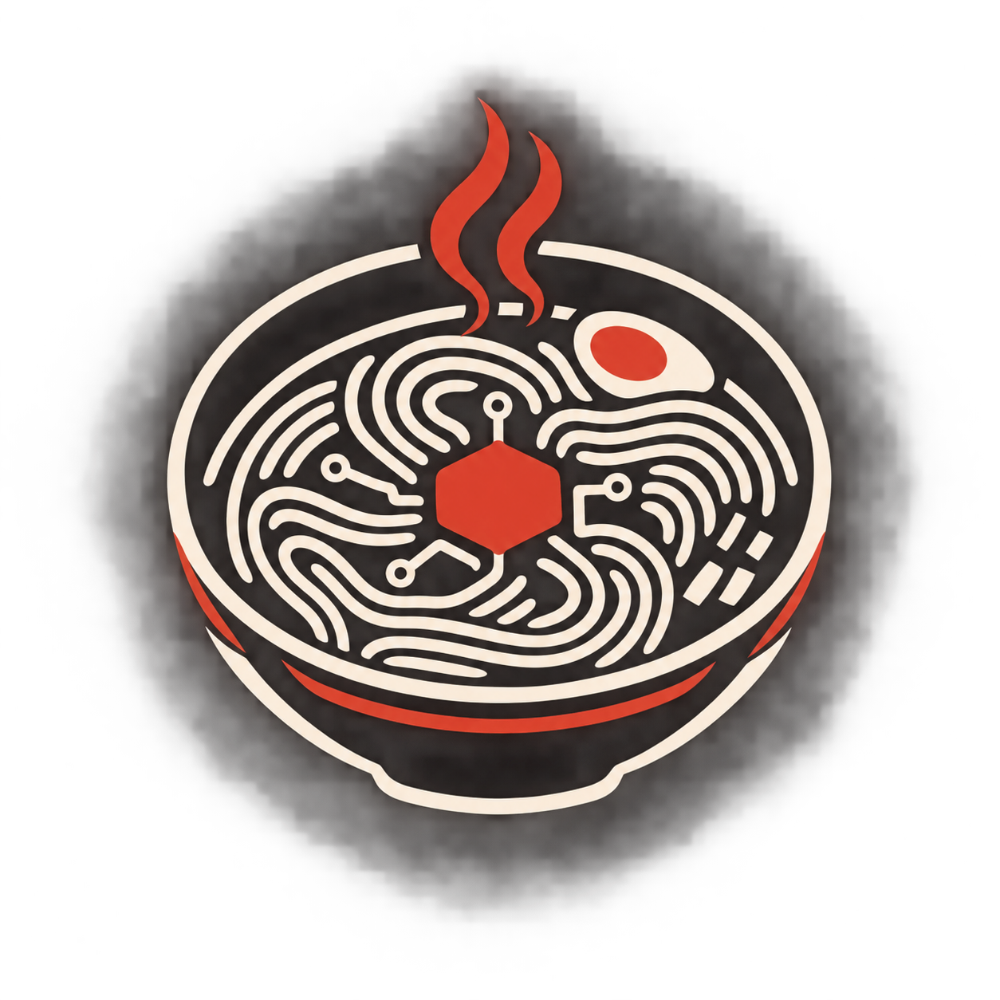
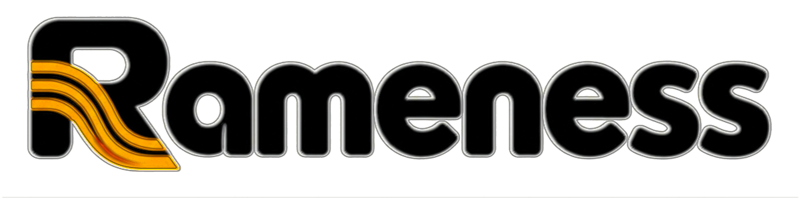

<div align="center"></div>
<div align="center"></div>


**Rameness runs coding and research tasks with AI models from your terminal, works well with local
models on your own GPU, and gets faster at work it has done before.**

## What you use it for

**Fix a bug or add a feature in a repository.** Describe the task; one agent reads the code, edits the
files, runs the tests, and stops when the work is checked. It asks before every command unless you pass `-y`.

```bash
cd my-repo
rameness run "test_login fails since the last commit, find out why and fix it"
```

**Run it on your own hardware.** Point it at llama.cpp, vLLM, ollama or any OpenAI-compatible server, or
use Claude, OpenAI or DeepSeek. With local models it sets the thinking budget, context limit and sampling
for the server it finds. On a 150-minute build test, Qwen3.8-27B on one GPU scored, in its best run,
the same as Claude Code with Claude Opus ([Benchmarks](docs/benchmarks.md)).

```bash
rameness --base-url http://localhost:8080/v1 run "add CSV export to the reports page"
```

**Hand a bigger job to a team.** A manager splits the work across agents, each on its own git branch,
model and machine (for example a local model for routine parts, Claude for hard ones, a GPU box over
ssh). It runs rounds of improvement and testing, and brings you only the decisions that matter, in a web UI.

```bash
rameness up                                                   # manager + UI on http://127.0.0.1:7788
rameness fleet ask "build a habit tracker web app" --cycles 4  # a first build, then 4 rounds of improvement
```

**Stop paying for the same work twice.** After each run, Rameness looks at what it did over its last few
runs. A multi-step procedure it keeps repeating, such as "start a local server and check the page in a
browser" or "run the package's tests plus a check per reported issue", becomes a tested script (an SOP)
that later runs call in one step. On a series of eight similar tasks, that cut task time by a third and
tokens by half. Useful SOPs can be shared publicly in [RamenSOPs](https://github.com/Prog-Ramen/RamenSOPs);
anything specific to you stays on your machine.

## What makes it different

Other harnesses (Claude Code, Codex, pi) hard-code their choices: whether a task needs reasoning, which
procedure applies, which model and machine should do the work, what to do when something fails.
Rameness hands each of those choices to a small decision model (JEV: Clef-Flash, Kev or Laya running
locally, swappable with one setting, or TypeSafe AI's hosted Jev) that scores the options in about a second or less. Routine choices it makes
alone; significant or uncertain ones come to you. You can watch every decision live, and your
corrections make the next ones better.

## Quick start

```bash
curl -fsSL https://raw.githubusercontent.com/Prog-Ramen/Rameness/main/install.sh | bash
rameness jev up                          # start the decision model (Laya, installed by default)
cd your-project && rameness init
rameness run "fix the failing test"      # one agent
```

[Getting started](docs/getting-started.md) covers choosing a decision model, connecting your models, and
every command.

> **Safety:** tools act on your machine as you, and ask before each action by default. Use `-y` (approve
> everything) only somewhere disposable. The UI has no authentication and binds to 127.0.0.1.
> [More](docs/getting-started.md#safety).

## How it works

Each piece in a sentence; follow the link for the details.

| | In brief |
|---|---|
| [**Decisions (JEV)**](docs/decisions.md) | A typed decision model scores the options for every choice the harness makes; it sees only what that decision needs. |
| [**The agent loop**](docs/agent.md) | One agent works a task in turns: JEV sets how hard to think, guards catch loops, context is compacted before it overflows. |
| [**The team**](docs/fleet.md) | A manager runs leads and associates, each on its own model, runtime and machine, and hands you the significant decisions. |
| [**SOPs**](docs/sops.md) | Tested procedures the agent calls like tools; only tested ones are offered, so the agent can trust them. |
| [**Learning**](docs/learning.md) | After each run, repeated multi-step work becomes a new SOP, if it saves more than it costs. |
| [**Sharing SOPs**](docs/sharing.md) | Private, public registry or built-in: each SOP goes where it belongs, with its tests, past secret and privacy checks. |

## Results

On a 150-minute open-ended build (a Minecraft clone in the browser, 14 behaviour checks plus a visual
grade), Rameness's best runs with local models match Claude Code with Claude Opus:

| Harness + model | Behaviour | Visual (0-10) |
|---|---|---|
| Claude Code + Claude Opus 5.5 (reference) | 100% | 7.25 |
| Rameness + Qwen3.8-27B UD-Q4_K_M (llama.cpp) | 100% | 7.25 |
| Rameness + Qwen3.8-Flash-Next AutoRound 3bpw (vLLM), Kev | 100% | 7.5 |
| Rameness + Qwen3.8-Flash-Next AutoRound 3bpw (vLLM), Clef-Flash | 100% | 8.0 ([human review](docs/benchmarks.md#human-review-of-the-clef-build); judge 6.5) |

On a series that repeats one procedure, learned SOPs cut task time by a third and tokens by half.
[Benchmarks](docs/benchmarks.md) has every run, the charts, and the caveats (variance is large).

## Docs

| Doc | In brief |
|---|---|
| [Getting started](docs/getting-started.md) | Install, pick a decision model, run your first task, stay safe. |
| [Decisions (JEV)](docs/decisions.md) | The decision model, its backends and accuracy, and every choice it makes. |
| [The agent loop](docs/agent.md) | Routing, turns, tools, hooks, guards, context, stopping, local models. |
| [The team (fleet)](docs/fleet.md) | Roles, resources, autonomy modes, the comfort gate, cycles, shadow mode. |
| [SOPs](docs/sops.md) | Format, tests, layers, your own private folders. |
| [Learning](docs/learning.md) | How repeated work becomes an SOP, and when it is worth one. |
| [Sharing SOPs](docs/sharing.md) | The three tiers, where tests go, safety checks, pulling from the registry. |
| [Experiments](docs/experiments.md) | Features behind flags, and the A/B evidence for each. |
| [Benchmarks](docs/benchmarks.md) | The tasks Rameness is measured on, and the results. |
| [Architecture](docs/architecture.md) | Diagrams of how it all works, and where everything lives in the code. |
| [Iterations](docs/iterations.md) | What changed between versions, and whether each change reached its runs. |

## Acknowledgements

The team orchestration took inspiration from firstmate. Decision models:
[Kev](https://github.com/jaredpalmer/kev) (Jared Palmer), [Laya](https://github.com/NandhaKishorM/laya)
(Convai Innovations) and [TypeSafe AI's Jev](https://docs.typesafe.ai/api).
