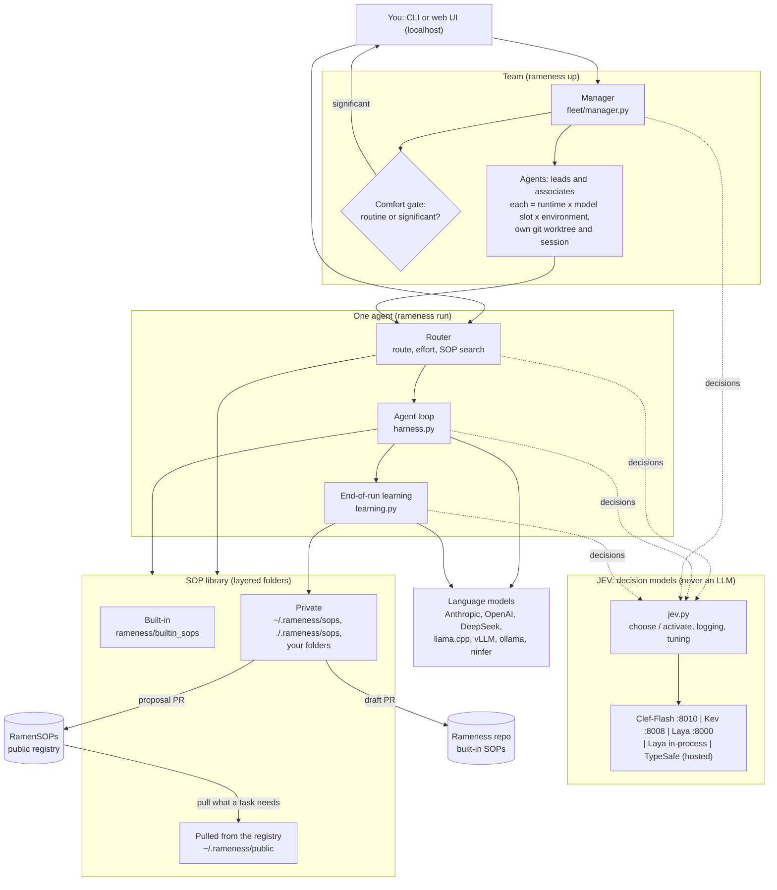
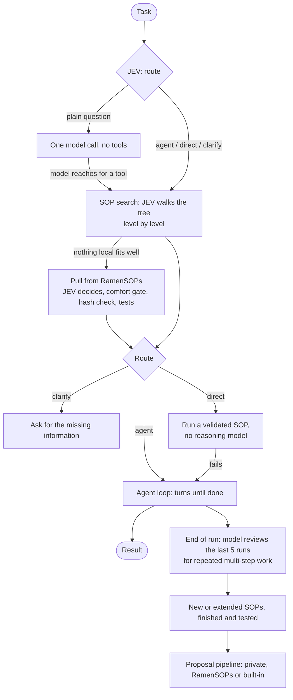
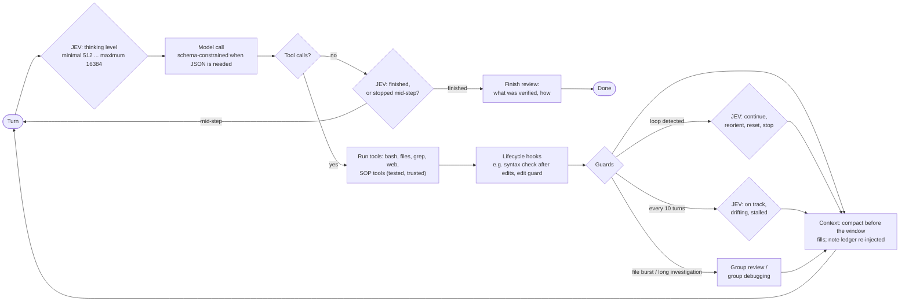
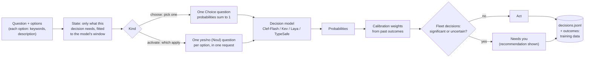
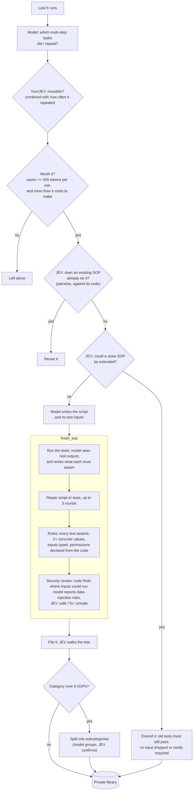
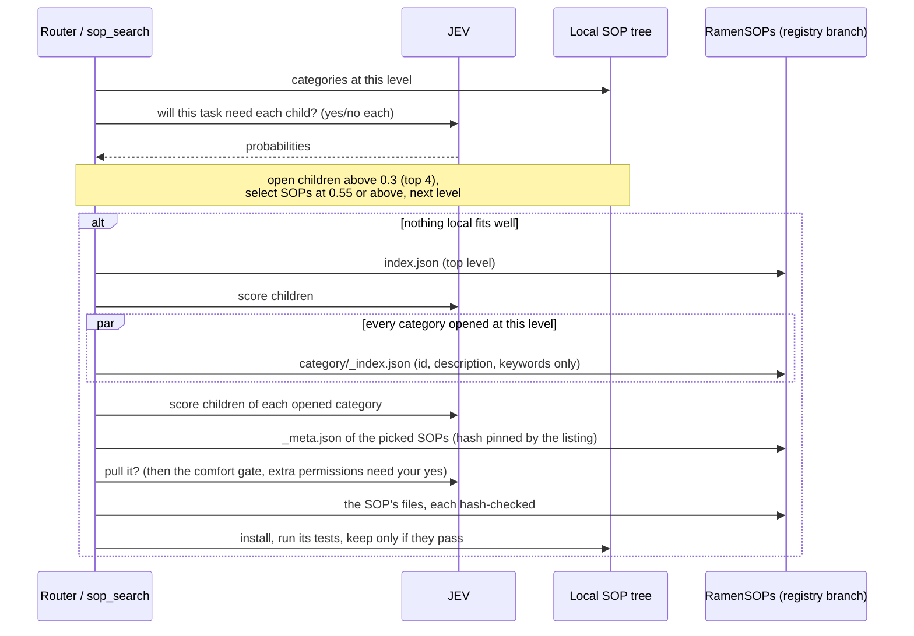
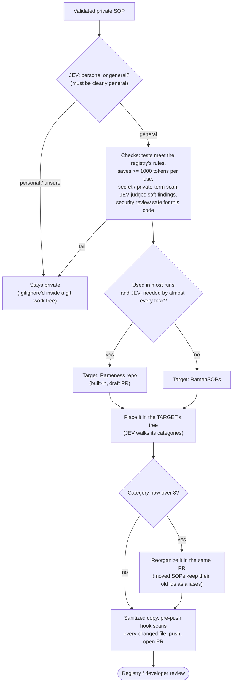
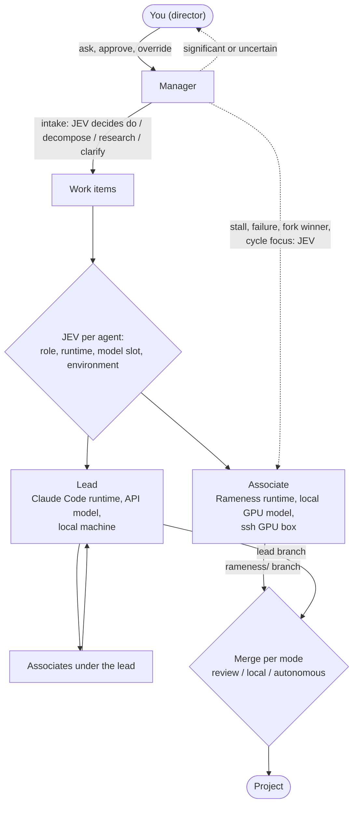

# Architecture

**In brief:** Rameness is an agent harness in which a small typed decision model (JEV) makes every
multiple-choice call, a language model does the thinking and writing, and tested procedures (SOPs) run as code.
The diagrams go from the whole system down to each mechanism; the code map is at the end.

## The whole system

Who talks to whom, from the person at the keyboard to the model servers and the public SOP registry.



## One task, end to end

What happens between typing a task and getting a result.



## One agent turn

The agent loop: JEV sets how hard to think, the model acts, code checks and guards keep it on track.



## How a JEV decision is made

Every choice is a typed question to a decision model: probabilities over fixed options, no generated text.



## How an SOP is born

From repeated work to a tested, reviewed SOP, without outside help.



## Finding and pulling SOPs

The tree stays small at every level, so a search touches a few small listings (Dremel-style).



## How an SOP is shared

Domain-specific stays private; generalizable goes to RamenSOPs; super-generic becomes a built-in.



## The team

The manager runs agents on any mix of models and machines and hands you the significant decisions.



## Code map

```
rameness/
  jev.py            decision engine: Clef / Kev / Laya / TypeSafe backends (lexical offline fallback), comfort gate, tuning hot-reload
  jevserve.py       setup / start / stop of local Clef, Kev and Laya servers
  clef_serve.py     Clef-Flash behind the System One API (run in Clef's own environment)
  jevbench.py       `rameness jev bench`: accuracy of the active decision model on labelled harness decisions
  router.py         task triage: route, effort, direct SOP execution, registry pulls; skips the SOP search for plain questions
  harness.py        agent loop: turns, stop/finish checks, group review/debug, feature cycles, note ledger, images, delegation, learning hook
  featurebranch.py  feature cycles on their own git branch and folder, merged only once verified
  thinking.py       per-turn thinking levels (JEV) → reasoning budgets / effort
  hooks.py          lifecycle hooks: JEV-selected SOPs run at on_start / after_output / before_finish / on_end
  progress.py       periodic progress review (JEV)
  loopguard.py      loop / degeneration detection and JEV-chosen recovery
  context.py        artifact store, recall, calibrated token counts, staged compaction
  llm.py            Anthropic SDK + OpenAI-compatible (llama-server, ollama, vLLM, DeepSeek), text tool protocol, sampling profiles, vision, server detection
  schemas.py        JSON schemas for every model call whose reply must be JSON
  tools.py          bash/read/write/edit/edit_lines/grep/glob/web_fetch, line anchors, images, environment-aware
  sops.py           hierarchical SOP library and private folders, level-by-level search with defer, executor (local or remote env), isolated tests
  tree.py           keeps the SOP tree small per level: placement by walking it, split on overflow, fold, aliases
  sopsafety.py      security review: code finds where an input could run, the model judges, JEV decides
  builtin_sops/     starter SOP package, including code/syntax_check (the after_output hook)
  deps.py           the packages and programs an SOP may need (from its imports and commands)
  learning.py       end-of-run review → value check → SOP generation, extension → finish_sop (tests, repair, security)
  discover.py       `rameness sop discover`: candidate SOPs from event logs
  improve.py        feedback, calibration, model-proposed cue tuning, training export
  publish.py        scrubber, secret scanning, personal-vs-general, category and built-in-vs-registry decisions
  registry.py       propose SOPs as PRs: built-in (Rameness repo, draft) or registry (RamenSOPs); test rules; target-tree placement; pre-push hooks
  review.py         conservative local registry preflight; execute untrusted tests in a sandbox
  remote.py         lazy, activation-driven pulls of individual SOPs from a sharded, columnar registry index
  telemetry.py      optional metrics push (RAMENESS_TELEMETRY_URL)
  fleet/
    manager.py      the manager: JEV decisions, comfort gate, autonomy modes, CRUD, scheduling, supervision, merging
    cycles.py       cycle programs (refine / test), the work taxonomy
    worker.py       Rameness-runtime agent process (ask_manager, inbox, transcripts for resume/fork)
    slots.py        model / runtime discovery and capacity
    envs.py         local / ssh / container / exec environments and capability probes
    sessions.py     herdr, tmux, screen, subprocess backends
    worktree.py     per-agent git worktrees and merges
    store.py        SQLite state (agents, events, decisions, escalations, messages)
    server.py       JSON API + UI server
    ui/index.html   the UI
install.sh          one-environment installer
docs/               these docs
bench/              benchmarks (see Benchmarks)
examples/acme/      an organization profile and private SOPs
```

The registry side, where proposals are reviewed and merged, is described in
[RamenSOPs' architecture](https://github.com/Prog-Ramen/RamenSOPs/blob/main/docs/architecture.md).
