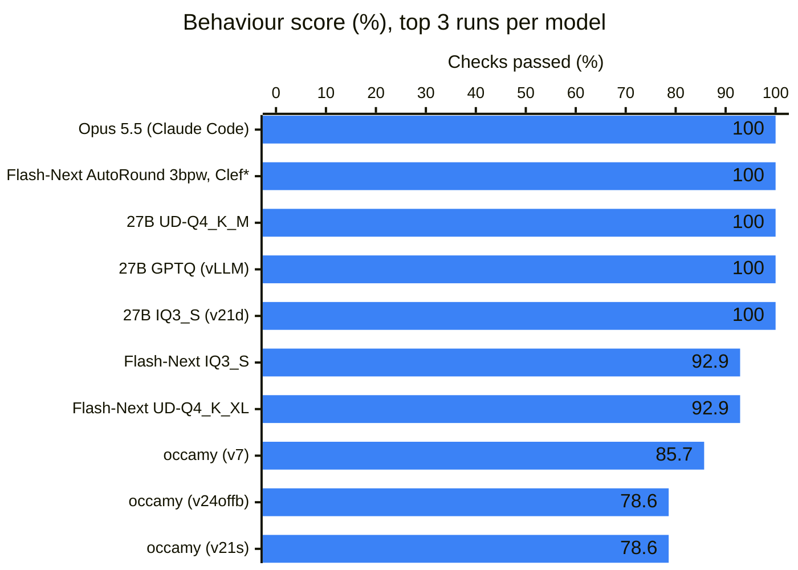
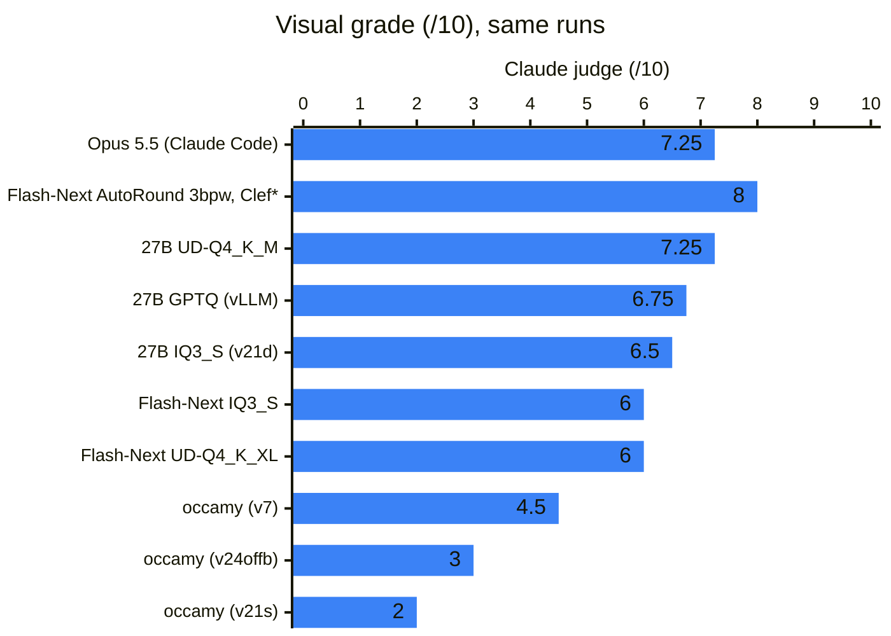
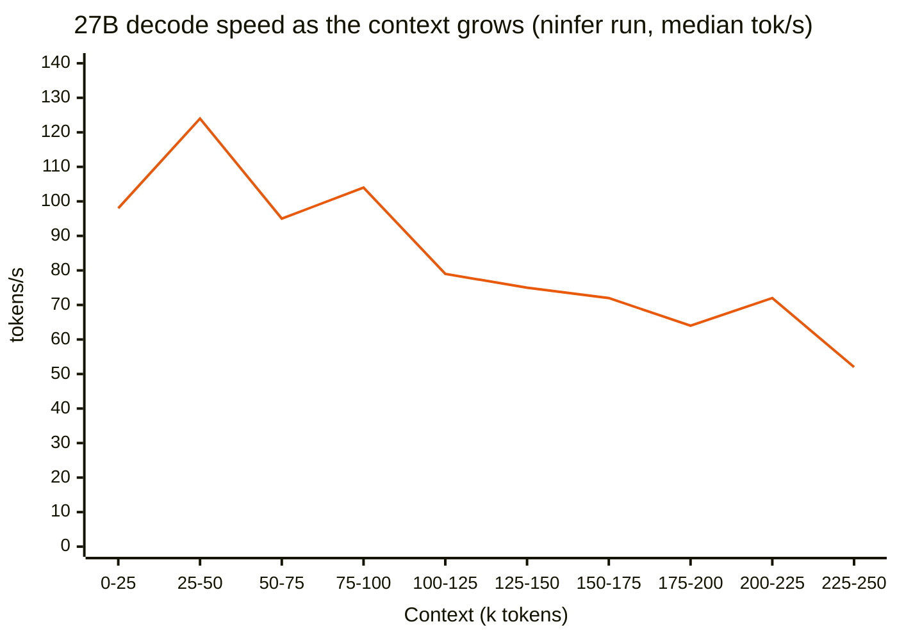

# Benchmarks

**In brief:** Rameness is measured on a long open-ended build (a Minecraft clone in the browser), shorter
tasks (bugfix, research, data), and an SOP-reuse series (projreport). Run-to-run variance is large, so
treat these as indications, not a leaderboard.

## Minecraft: a long, open-ended build

"A Minecraft clone in the browser" in 150 minutes, scored by 14 behaviour checks in a real browser plus a
0-10 visual grade of the final screen.

| Harness + model | Behaviour | Visual (0-10) |
|---|---|---|
| Claude Code + Claude Opus 5.5 (reference, 13.7 min) | 100% | 7.25 |
| **Rameness + Qwen3.8-Flash-Next AutoRound 3bpw** (vLLM, MTP 3; JEV Kev) | **100%** (rescored, was 92.9%) | **7.5** |
| **Rameness + Qwen3.8-Flash-Next AutoRound 3bpw** (vLLM, MTP 3; JEV Clef-Flash) | **100%** | **8.0**\* |
| **Rameness + Qwen3.8-27B UD-Q4_K_M** (llama.cpp) | **100%** | 7.25 |
| Rameness + Qwen3.8-27B GPTQ (vLLM, DFlash2; 2 runs) | 78.6-100% | 6.75 |
| Rameness + Qwen3.8-27B (v14-v22, 14 runs) | 71-100%, 11 of 14 at 92.9% or more | 1.0-6.5 |
| Rameness + Qwen3.8-27B on ninfer (DFlash2) | 100% | 5.0 |
| Claude Code + Qwen3.8-27B (2 runs) | 92.9-100% | 3.75-5.5 |
| Rameness + occamy-1.0 (35B-A3B, 3.4-bit quant) | 14-86% | 0-4.5 |
| Claude Code + occamy-1.0 (1 run) | 64% | 3.25 |

Rameness started at 0% on this task (2026-09-25). What changed in each version, the runs that followed,
and whether each change reached them is in [Iterations](iterations.md); the run records are in
[bench/minecraft/runs](../bench/minecraft/runs/README.md). Identical code has scored 35.7% and 78.6%.

\* **Human review grade:** the automated judge gave the Clef build 6.5 from one screenshot of one random world;
reviewed as a whole, it was graded 8.0. The reasoning is in [Human review of the Clef build](#human-review-of-the-clef-build).
Every other visual grade is the automated judge's.

**Scorer fix (2026-10-09).** The block-breaking check clicked once and looked for a change. Minecraft mines
by holding the button (about 0.75 s for dirt or grass by hand), so a faithful game failed it. It now holds the
left button for 2.5 s; a game that breaks on a click still passes. 63 archived runs failed this check, most of
the 92.9% scores among them. The AutoRound + Kev build, rescored three times, passes all 14 (it was 92.9%);
the other archived runs have not been rescored yet, so their behaviour scores may be understated by one check.

The best three runs of each model, ordered by score and then by visual grade (Claude Code + Opus is the
reference; every other run is Rameness; \* the human review grade, see above):





A dense 27B slows down as its context grows, because it reads its whole KV cache at every step.
Flash-Next's sparse attention reads a fixed 2,048 tokens, and held about 150 tokens/s from 1k to 160k
tokens of context in the speed tests.



## Minecraft: Kev vs Clef

The same model and server with Kev (2026-10-07) and with Clef-Flash (2026-10-09) as the decision model.

Flash-Next AutoRound 3bpw on vLLM (MTP 3, CMP 170HX), 150 minutes each. Both builds pass all 14 checks. The
decision models differed most in how hard they let the model think: Kev chose *minimal* on half the turns,
Clef chose *maximum* on a third of them; Clef also decided in 0.18 s against Kev's 1.5 s
([decision-level data](decisions.md#kev-vs-clef)).

| | Kev | Clef-Flash |
|---|---|---|
| Behaviour / visual | 100% / 7.5 | 100% / **8.0**\* (automated judge: 6.5) |
| Game code / its own tests | 4,166 / 2,314 lines | 4,485 / 2,677 lines (5,192 / 3,722 with the unmerged round) |
| Model calls / tokens written / time generating | 489 / 664k / 103 min | 628 / 577k / 92 min |
| Minecraft features (56-item checklist) | 47 | 48 (53 with the unmerged round) |
| Biomes | 5 | 9, picked by temperature and humidity like the real game ("Snowy Plains", taiga, savanna...) |
| Caves | carved during generation | 1.18-style "cheese" and "spaghetti" noise caves (they reach the surface too often) |
| Only in this build | lava, crafting table block, a 3D hand | survival and creative modes, tools with mining speed |
| Where the time went | ~45 min chasing a white/dark rendering bug | core done by minute 69, then a feature round |

Two things the comparison exposed, beyond the decision model:

* **A feature round can be lost at the deadline.** The Clef run's feature round (passive animals, hunting,
  food, beds, lava, tool wear) passed its own checks but was still being verified at minute 149, so it was
  never merged into the project and is not in the judged build.
* **One screenshot of a random world decides the visual grade.** Both games pick a new world each load. The
  Clef build was judged on a savanna coast, where its trees are 2% per 8x8 cell, so the judge saw none; a
  forest spawn would have looked quite different.

The runs are one each and two days apart, so harness changes sit between them too; the decision-level
measurements are the controlled comparison.

### Human review of the Clef build

Why the Clef build is graded 8.0 by hand (2026-10-09), against the automated judge's 6.5.

**What the judge saw.** One screenshot, of one world chosen at random on load: a savanna coast. The judge's
notes: "convincing Minecraft-style textured blocks, sky, water and hotbar, but the terrain is sparse with no
trees visible, the held-item sprite is a white square, and the shading is a bit dark in places".

**Why that undersells it.**

* **No trees is the biome, not a missing feature.** Trees are placed per biome, by design: taiga 14% and forest
  10% per 8x8 cell, savanna 2%, plains 1.4%, beach 0%. A savanna coast shows almost none; a forest or taiga
  spawn (spruce with layered cone-shaped leaves) looks quite different.
* **The world is closer to modern Minecraft.** 9 biomes chosen from temperature and humidity noise, as the real
  game does, with its current names ("Snowy Plains" is the 1.18 rename), against 5 in the Kev build; frozen
  water in cold biomes; deserts with cacti.
* **The caves follow Caves & Cliffs.** 1.18-style "cheese" caves (large noise blobs) and "spaghetti" tunnels
  (thin noise bands). They break through the surface more often than the real game's do, which leaves pits
  and trenches in some views, but the approach is the current game's.
* **More of the game is there.** Survival and creative modes; tools (wooden and stone pickaxe, axe, shovel) that
  change mining speed with block hardness; hold-to-mine; sprint by double-tapping W, sneak, middle-click pick
  block, F3 debug screen; a start screen with a world seed. On a 56-item checklist of Minecraft features it has
  48 against the Kev build's 47 (53 counting the feature round that was finished but not merged in time:
  passive animals, hunting, food, beds, lava, tool wear).
* **More work in the same time.** About 25% more game code and 60% more of its own tests than the Kev build,
  using 13% fewer tokens.

**What still counts against it.** The held item is drawn on a white card; caves open to the surface too often;
there is no crafting table block (crafting is a list in the inventory screen) and one recipe is invented (wool
from leaves). These keep it from a higher grade.

**Why 8.0.** On visual quality alone the judged screenshot is fair, 6.5 to 7. Judged as a Minecraft build
across the worlds it actually generates, with the most faithful world generation and game mechanics of any
local-model run so far, it is above the Kev build's 7.5, and 8.0 reflects that while counting the flaws above.

## projreport: does SOP reuse pay off?

Eight tasks that repeat one procedure, run with the SOP pipeline on and off.

Each task is a folder of six small Python projects; the agent writes `report.json` with each project's
`.py` file count, line count, TODO comments and whether its tests pass. The same procedure repeats six
times per task and again in every task, which makes it an ideal test of learning a procedure once and
reusing it. `bench/tasks/projreport/make.py` generates `projreport1`…`8` from fixed seeds; each has a
hidden answer and a 25-check scorer. Synthetic and easy: it measures SOP reuse, not general quality.

Flash-Next AutoRound, 8 tasks per arm:

| Arm | Score | Task time | Task tokens | End-of-run learning |
|---|---|---|---|---|
| Control (no learning) | 100% | 62.5 min | 300k | — |
| SOP pipeline | 100% | 50.4 min | 166k | 31.6 min |
| SOP pipeline, trusted SOPs | 100% | 42.4 min | 155k | 23.4 min |

SOPs cut task time by a third and tokens by half; the end-of-run learning still costs about as much time
as they save over eight tasks.

## Shorter tasks and A/B runs

`bench/tasks` holds bugfix, research and data tasks; `bench/ab.py` runs paired arms
([Experiments](experiments.md#running-an-ab)).

## The bench folder

```
bench/
  minecraft/        the long build benchmark (run, score, judge), archive.py, and the runs/ records
  tasks/            shorter tasks: bugfix, research, data, projreport
  llmproxy.py       recording proxy between the harness and the model server
  grafana/          dashboard generator
  ab.py             A/B runner
```
