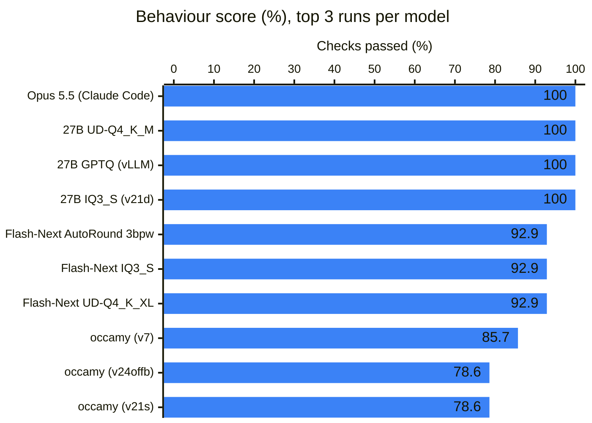
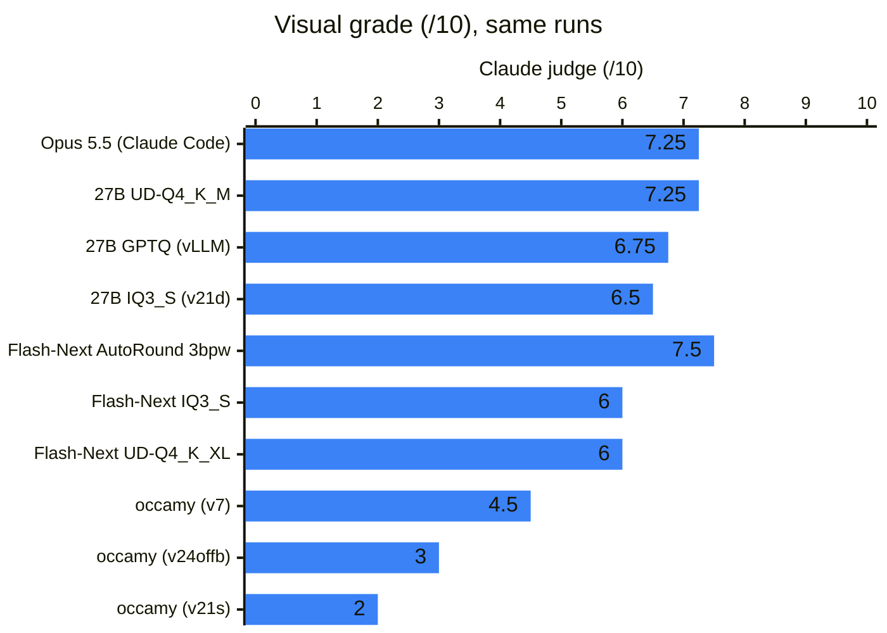
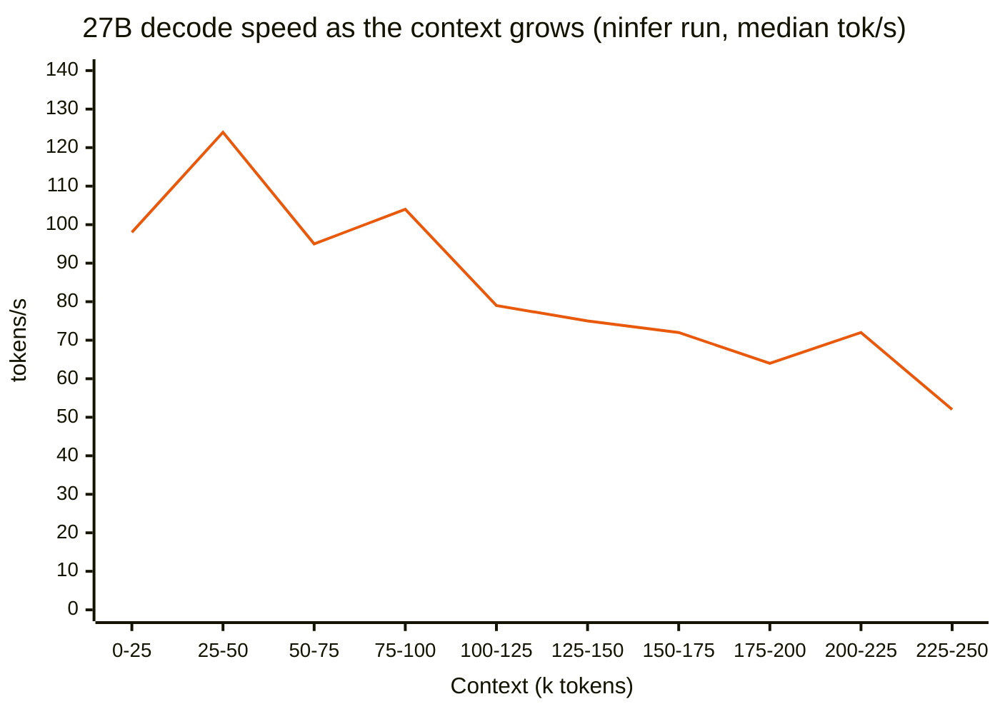

# Benchmarks

**In brief:** Rameness is measured on a long open-ended build (a Minecraft clone in the browser), shorter
tasks (bugfix, research, data), and an SOP-reuse series (projreport). Run-to-run variance is large, so
treat these as indications, not a leaderboard.

## Minecraft: a long, open-ended build

"A Minecraft clone in the browser" in 150 minutes, scored by 14 behaviour checks in a real browser plus a
0-10 visual grade of the final screen.

| Harness + model | Behaviour | Visual (0-10) |
|---|---|---|
| Claude Code + Claude Opus 5.5 (reference, 13.7 min) | 100% | 7.25 |
| **Rameness + Qwen3.8-Flash-Next AutoRound 3bpw** (vLLM, MTP 3; current workflow) | 92.9% | **7.5** |
| **Rameness + Qwen3.8-27B UD-Q4_K_M** (llama.cpp) | **100%** | 7.25 |
| Rameness + Qwen3.8-27B GPTQ (vLLM, DFlash2; 2 runs) | 78.6-100% | 6.75 |
| Rameness + Qwen3.8-27B (v14-v22, 14 runs) | 71-100%, 11 of 14 at 92.9% or more | 1.0-6.5 |
| Rameness + Qwen3.8-27B on ninfer (DFlash2) | 100% | 5.0 |
| Claude Code + Qwen3.8-27B (2 runs) | 92.9-100% | 3.75-5.5 |
| Rameness + occamy-1.0 (35B-A3B, 3.4-bit quant) | 14-86% | 0-4.5 |
| Claude Code + occamy-1.0 (1 run) | 64% | 3.25 |

Rameness started at 0% on this task (2026-09-25). What changed in each version, the runs that followed,
and whether each change reached them is in [Iterations](iterations.md); the run records are in
[bench/minecraft/runs](../bench/minecraft/runs/README.md). Identical code has scored 35.7% and 78.6%.

The best three runs of each model, ordered by score and then by visual grade (Claude Code + Opus is the
reference; every other run is Rameness):





A dense 27B slows down as its context grows, because it reads its whole KV cache at every step.
Flash-Next's sparse attention reads a fixed 2,048 tokens, and held about 150 tokens/s from 1k to 160k
tokens of context in the speed tests.



## projreport: does SOP reuse pay off?

Eight tasks that repeat one procedure, run with the SOP pipeline on and off.

Each task is a folder of six small Python projects; the agent writes `report.json` with each project's
`.py` file count, line count, TODO comments and whether its tests pass. The same procedure repeats six
times per task and again in every task, which makes it an ideal test of learning a procedure once and
reusing it. `bench/tasks/projreport/make.py` generates `projreport1`…`8` from fixed seeds; each has a
hidden answer and a 25-check scorer. Synthetic and easy: it measures SOP reuse, not general quality.

Flash-Next AutoRound, 8 tasks per arm:

| Arm | Score | Task time | Task tokens | End-of-run learning |
|---|---|---|---|---|
| Control (no learning) | 100% | 62.5 min | 300k | — |
| SOP pipeline | 100% | 50.4 min | 166k | 31.6 min |
| SOP pipeline, trusted SOPs | 100% | 42.4 min | 155k | 23.4 min |

SOPs cut task time by a third and tokens by half; the end-of-run learning still costs about as much time
as they save over eight tasks.

## Shorter tasks and A/B runs

`bench/tasks` holds bugfix, research and data tasks; `bench/ab.py` runs paired arms
([Experiments](experiments.md#running-an-ab)).

## The bench folder

```
bench/
  minecraft/        the long build benchmark (run, score, judge), archive.py, and the runs/ records
  tasks/            shorter tasks: bugfix, research, data, projreport
  llmproxy.py       recording proxy between the harness and the model server
  grafana/          dashboard generator
  ab.py             A/B runner
```
